# PEPSINO LAB

# SOFTWARE REQUIREMENTS SPECIFICATION (SRS)

# DOCUMENT 03

# DATABASE DESIGN (ERD + DATABASE SCHEMA)

---

# PURPOSE

This document is the backbone of PEPSINO LAB.

Every module defined in Document 02 (PRD) maps to the entities, relationships, and rules defined here. All application layers — Student Dashboard, Mentor Dashboard, Reports, Leaderboards, Notifications — read from and write to this schema.

Target engine: **PostgreSQL 16+**.

The design is engine-agnostic where possible; PostgreSQL-specific features used are: `UUID`, `ENUM` types, `JSONB`, partial indexes, and generated columns.

---

# DESIGN PRINCIPLES

## P1 — Identity is permanent

`students.student_code` (e.g. `PPL-250001`) is generated once and **never changes**. It never encodes Lab, Level, or Season. Lab and Level are derived state; identity is not.

## P2 — Currencies are ledgers, not counters

XP and Coins are **append-only ledgers** (`xp_events`, `coin_transactions`). Balances shown in the UI are cached aggregates that can always be rebuilt from the ledger. XP history is stored forever (PRD Module 07). Ledger rows are never updated or deleted — corrections are compensating entries.

## P3 — Progression is derived, then cached

Level and Lab are computed from total XP + stamp count against the rules table (`level_definitions`). Cached copies live on `students` for fast dashboard reads; a level-up writes a `level_history` row.

## P4 — Everything a mentor does is auditable

Mission approvals, stamps, coin/XP adjustments, notes, exam records, and attendance all carry `created_by` (the acting user) and timestamps.

## P5 — Seasons scope activity, not identity

A student belongs to the platform forever; their activity (missions, attendance, exams, rankings, summaries) is scoped to a `season`.

## P6 — Soft delete for people, hard rules for money

User-facing entities (`users`, `students`) use `deleted_at` soft deletes. Ledgers are immutable. Reference/config tables (labs, levels, achievement definitions) are versioned by `is_active` flags, never deleted while referenced.

---

# HIGH-LEVEL ERD

```mermaid
erDiagram
    users ||--o| students : "is a"
    users ||--o| mentors : "is a"
    users ||--o| parents : "is a (future)"
    users ||--o{ auth_identities : "signs in with"

    mentors ||--o{ mentor_assignments : "manages"
    students ||--o{ mentor_assignments : "assigned to"
    parents ||--o{ parent_links : "watches"
    students ||--o{ parent_links : "watched by"

    seasons ||--o{ enrollments : "contains"
    students ||--o{ enrollments : "joins"

    labs ||--o{ level_definitions : "groups"
    level_definitions ||--o{ level_history : "reached in"
    students ||--o{ level_history : "progresses"

    seasons ||--o{ mission_boards : "has daily"
    students ||--o{ mission_boards : "owns"
    mission_boards ||--o{ mission_entries : "contains"
    mission_templates ||--o{ mission_entries : "instantiates"

    students ||--o{ logbook_entries : "reflects"
    logbook_entries ||--o| stamps : "earns"
    students ||--o{ stamps : "collects"

    students ||--o{ planner_tasks : "plans"

    students ||--o{ xp_events : "earns"
    students ||--o{ coin_transactions : "earns/spends"

    achievement_definitions ||--o{ student_achievements : "unlocked as"
    students ||--o{ student_achievements : "unlocks"

    seasons ||--o{ class_sessions : "schedules"
    class_sessions ||--o{ attendance_records : "records"
    students ||--o{ attendance_records : "attends"

    seasons ||--o{ exams : "contains"
    exams ||--o{ exam_results : "graded as"
    students ||--o{ exam_results : "takes"

    students ||--o{ mentor_notes : "annotated by"
    students ||--o{ reports : "summarized in"
    seasons ||--o{ season_summaries : "closes with"
    students ||--o{ season_summaries : "receives"

    users ||--o{ notifications : "receives"
    seasons ||--o{ announcements : "broadcasts"
    seasons ||--o{ challenges : "runs"
    challenges ||--o{ challenge_participants : "joined by"
    students ||--o{ challenge_participants : "competes"
```



---

# ENUM TYPES

```sql
CREATE TYPE user_role          AS ENUM ('student', 'mentor', 'admin', 'parent');
CREATE TYPE auth_provider      AS ENUM ('email', 'google', 'sms');
CREATE TYPE lab_key            AS ENUM ('neuro', 'research', 'catalyst', 'pioneer');
CREATE TYPE mission_kind       AS ENUM ('routine', 'target1', 'target2', 'target3',
                                        'target4', 'target5', 'target6');
CREATE TYPE mission_status     AS ENUM ('pending', 'completed', 'approved', 'rejected');
CREATE TYPE attendance_status  AS ENUM ('present', 'late', 'absent', 'excused');
CREATE TYPE xp_source          AS ENUM ('mission', 'stamp', 'attendance', 'exam',
                                        'achievement', 'challenge', 'manual_adjustment');
CREATE TYPE coin_source        AS ENUM ('mission', 'achievement', 'challenge',
                                        'manual_adjustment', 'marketplace_purchase');
CREATE TYPE report_kind        AS ENUM ('weekly', 'monthly', 'season');
CREATE TYPE notification_kind  AS ENUM ('mission_reminder', 'new_badge', 'level_up',
                                        'mentor_message', 'announcement', 'challenge_started');
CREATE TYPE season_status      AS ENUM ('draft', 'active', 'closed');
```

---

# SCHEMA — IDENTITY & ACCESS

## Table: `users`

One row per human, regardless of role. Authentication credentials live in `auth_identities` so a user can attach Email now and Google/SMS later (PRD Module 02).

```sql
CREATE TABLE users (
    id              UUID PRIMARY KEY DEFAULT gen_random_uuid(),
    role            user_role NOT NULL,
    full_name       TEXT NOT NULL,
    email           CITEXT UNIQUE,
    phone           TEXT UNIQUE,
    avatar_url      TEXT,
    email_verified_at TIMESTAMPTZ,
    locale          TEXT NOT NULL DEFAULT 'en',
    created_at      TIMESTAMPTZ NOT NULL DEFAULT now(),
    updated_at      TIMESTAMPTZ NOT NULL DEFAULT now(),
    deleted_at      TIMESTAMPTZ
);
```

## Table: `auth_identities`

```sql
CREATE TABLE auth_identities (
    id              UUID PRIMARY KEY DEFAULT gen_random_uuid(),
    user_id         UUID NOT NULL REFERENCES users(id) ON DELETE CASCADE,
    provider        auth_provider NOT NULL,
    provider_uid    TEXT NOT NULL,          -- email address, Google sub, phone number
    password_hash   TEXT,                   -- only for provider = 'email'
    last_login_at   TIMESTAMPTZ,
    created_at      TIMESTAMPTZ NOT NULL DEFAULT now(),
    UNIQUE (provider, provider_uid)
);
```

## Table: `students`

Extends `users`. Holds the permanent student code plus **cached** progression state (see P2/P3 — source of truth is the ledgers and `level_history`).

```sql
CREATE TABLE students (
    id              UUID PRIMARY KEY REFERENCES users(id) ON DELETE CASCADE,
    student_code    TEXT NOT NULL UNIQUE,        -- 'PPL-250001', immutable
    code_year       SMALLINT NOT NULL,           -- 25
    code_sequence   INTEGER NOT NULL,            -- 1
    -- cached progression (rebuildable)
    current_lab     lab_key NOT NULL DEFAULT 'neuro',
    current_level   SMALLINT NOT NULL DEFAULT 1
                    CHECK (current_level BETWEEN 1 AND 16),
    xp_total        BIGINT NOT NULL DEFAULT 0 CHECK (xp_total >= 0),
    coin_balance    BIGINT NOT NULL DEFAULT 0 CHECK (coin_balance >= 0),
    stamp_count_level SMALLINT NOT NULL DEFAULT 0,  -- stamps toward current level
    onboarded_at    TIMESTAMPTZ,                 -- first-login experience completed
    created_at      TIMESTAMPTZ NOT NULL DEFAULT now(),
    UNIQUE (code_year, code_sequence)
);
```

### Student code generation

```sql
CREATE TABLE student_code_counters (
    code_year   SMALLINT PRIMARY KEY,
    last_value  INTEGER NOT NULL DEFAULT 0
);
-- Allocation (inside the registration transaction):
-- UPDATE student_code_counters SET last_value = last_value + 1
--   WHERE code_year = $1 RETURNING last_value;
-- student_code := format('PPL-%s%s', code_year, lpad(last_value::text, 4, '0'));
```

Rules (PRD "Student ID Format"):

* Generated exactly once, at registration.
* Never re-issued, never recycled, never encodes Lab.
* `students.student_code` has no `UPDATE` path in the application layer.

## Table: `mentors`

```sql
CREATE TABLE mentors (
    id              UUID PRIMARY KEY REFERENCES users(id) ON DELETE CASCADE,
    title           TEXT,                        -- e.g. 'Physics Mentor'
    bio             TEXT,
    created_at      TIMESTAMPTZ NOT NULL DEFAULT now()
);
```

## Table: `mentor_assignments`

Which mentor manages which student, per season. Many-to-many so co-mentoring and re-assignment are possible without losing history.

```sql
CREATE TABLE mentor_assignments (
    id          UUID PRIMARY KEY DEFAULT gen_random_uuid(),
    mentor_id   UUID NOT NULL REFERENCES mentors(id),
    student_id  UUID NOT NULL REFERENCES students(id),
    season_id   UUID NOT NULL REFERENCES seasons(id),
    is_primary  BOOLEAN NOT NULL DEFAULT TRUE,
    assigned_at TIMESTAMPTZ NOT NULL DEFAULT now(),
    ended_at    TIMESTAMPTZ,
    UNIQUE (mentor_id, student_id, season_id)
);
```

## Tables: `parents`, `parent_links` (Future — schema reserved)

```sql
CREATE TABLE parents (
    id          UUID PRIMARY KEY REFERENCES users(id) ON DELETE CASCADE,
    created_at  TIMESTAMPTZ NOT NULL DEFAULT now()
);

CREATE TABLE parent_links (
    parent_id   UUID NOT NULL REFERENCES parents(id) ON DELETE CASCADE,
    student_id  UUID NOT NULL REFERENCES students(id) ON DELETE CASCADE,
    relation    TEXT NOT NULL DEFAULT 'guardian',
    created_at  TIMESTAMPTZ NOT NULL DEFAULT now(),
    PRIMARY KEY (parent_id, student_id)
);
```

Parents are strictly read-only; enforcement is at the API/authorization layer (no write endpoints for the `parent` role).

---

# SCHEMA — SEASONS & ENROLLMENT

## Table: `seasons`

```sql
CREATE TABLE seasons (
    id          UUID PRIMARY KEY DEFAULT gen_random_uuid(),
    name        TEXT NOT NULL,                   -- 'Season 1 — 2026'
    status      season_status NOT NULL DEFAULT 'draft',
    starts_on   DATE NOT NULL,
    ends_on     DATE NOT NULL,
    created_by  UUID NOT NULL REFERENCES users(id),   -- admin
    created_at  TIMESTAMPTZ NOT NULL DEFAULT now(),
    CHECK (ends_on > starts_on)
);
-- At most one active season at a time:
CREATE UNIQUE INDEX one_active_season ON seasons ((TRUE)) WHERE status = 'active';
```

## Table: `enrollments`

```sql
CREATE TABLE enrollments (
    id          UUID PRIMARY KEY DEFAULT gen_random_uuid(),
    season_id   UUID NOT NULL REFERENCES seasons(id),
    student_id  UUID NOT NULL REFERENCES students(id),
    enrolled_at TIMESTAMPTZ NOT NULL DEFAULT now(),
    withdrawn_at TIMESTAMPTZ,
    UNIQUE (season_id, student_id)
);
```

---

# SCHEMA — LABS & LEVELS (PROGRESSION RULES)

## Table: `labs`

Four rows seeded at install: Neuro, Research, Catalyst, Pioneer. Theme data (color, badge, background, animation key) is configuration, editable by admins (PRD Module 10).

```sql
CREATE TABLE labs (
    key             lab_key PRIMARY KEY,
    name            TEXT NOT NULL,
    tagline         TEXT NOT NULL,
    color_hex       TEXT NOT NULL,               -- '#0F8A8A'
    color_soft      TEXT NOT NULL,               -- 'rgba(15,138,138,0.12)'
    badge_label     TEXT NOT NULL,               -- 'N'
    background_url  TEXT,
    animation_key   TEXT,
    sort_order      SMALLINT NOT NULL,
    is_active       BOOLEAN NOT NULL DEFAULT TRUE
);
```

## Table: `level_definitions`

16 rows seeded at install (PRD Module 09). XP and stamp requirements are **data, not code**, so admins can tune rules without deployment ("Controls XP rules").

```sql
CREATE TABLE level_definitions (
    level           SMALLINT PRIMARY KEY CHECK (level BETWEEN 1 AND 16),
    lab_key         lab_key NOT NULL REFERENCES labs(key),
    xp_required     INTEGER NOT NULL DEFAULT 1200,   -- XP inside this level
    stamps_required SMALLINT NOT NULL DEFAULT 12,    -- mentor stamps inside this level
    title           TEXT                              -- optional display name
);
-- Seed mapping: levels 1–4 → neuro, 5–8 → research,
--               9–12 → catalyst, 13–16 → pioneer.
```

## Table: `level_history`

One row every time a student levels up. Powers the profile "Level History" (PRD Module 13).

```sql
CREATE TABLE level_history (
    id              UUID PRIMARY KEY DEFAULT gen_random_uuid(),
    student_id      UUID NOT NULL REFERENCES students(id),
    level           SMALLINT NOT NULL REFERENCES level_definitions(level),
    season_id       UUID REFERENCES seasons(id),
    xp_at_levelup   BIGINT NOT NULL,
    stamps_at_levelup SMALLINT NOT NULL,
    reached_at      TIMESTAMPTZ NOT NULL DEFAULT now(),
    UNIQUE (student_id, level)
);
```

### Level-up rule (business invariant)

A student advances from level *N* to *N+1* when **both** hold:

1. XP earned inside level *N* ≥ `level_definitions[N].xp_required` (default 1200)
2. Stamps earned inside level *N* ≥ `level_definitions[N].stamps_required` (default 12)

Lab changes automatically when the new level's `lab_key` differs. The student's code never changes (P1).

---

# SCHEMA — MISSIONS

## Table: `mission_templates`

Admin-defined defaults for the seven daily missions (Routine + Targets 1–6), with XP and Coin rewards.

```sql
CREATE TABLE mission_templates (
    id          UUID PRIMARY KEY DEFAULT gen_random_uuid(),
    kind        mission_kind NOT NULL,
    title       TEXT NOT NULL,
    description TEXT NOT NULL,
    xp_reward   INTEGER NOT NULL CHECK (xp_reward >= 0),
    coin_reward INTEGER NOT NULL CHECK (coin_reward >= 0),
    season_id   UUID REFERENCES seasons(id),     -- NULL = global default
    is_active   BOOLEAN NOT NULL DEFAULT TRUE,
    created_at  TIMESTAMPTZ NOT NULL DEFAULT now()
);
```

## Table: `mission_boards`

One board per student per day.

```sql
CREATE TABLE mission_boards (
    id          UUID PRIMARY KEY DEFAULT gen_random_uuid(),
    student_id  UUID NOT NULL REFERENCES students(id),
    season_id   UUID NOT NULL REFERENCES seasons(id),
    board_date  DATE NOT NULL,
    created_at  TIMESTAMPTZ NOT NULL DEFAULT now(),
    UNIQUE (student_id, board_date)
);
```

## Table: `mission_entries`

Seven rows per board. Status lifecycle: `pending → completed → approved | rejected`.

```sql
CREATE TABLE mission_entries (
    id              UUID PRIMARY KEY DEFAULT gen_random_uuid(),
    board_id        UUID NOT NULL REFERENCES mission_boards(id) ON DELETE CASCADE,
    template_id     UUID NOT NULL REFERENCES mission_templates(id),
    kind            mission_kind NOT NULL,
    status          mission_status NOT NULL DEFAULT 'pending',
    completed_at    TIMESTAMPTZ,
    reviewed_by     UUID REFERENCES mentors(id),
    reviewed_at     TIMESTAMPTZ,
    review_note     TEXT,
    xp_awarded      INTEGER NOT NULL DEFAULT 0,  -- frozen at approval time
    coins_awarded   INTEGER NOT NULL DEFAULT 0,
    UNIQUE (board_id, kind)
);
```

Reward flow: student marks `completed` → mentor `approved` → in the **same transaction** the system inserts one `xp_events` row and one `coin_transactions` row referencing this entry, and freezes `xp_awarded` / `coins_awarded` (so later template edits never change history).

---

# SCHEMA — LOGBOOK & STAMPS

## Table: `logbook_entries`

Daily reflection (PRD Module 05).

```sql
CREATE TABLE logbook_entries (
    id              UUID PRIMARY KEY DEFAULT gen_random_uuid(),
    student_id      UUID NOT NULL REFERENCES students(id),
    season_id       UUID NOT NULL REFERENCES seasons(id),
    entry_date      DATE NOT NULL,
    today_win       TEXT,
    today_challenge TEXT,
    tomorrow_focus  TEXT,
    mentor_note     TEXT,
    created_at      TIMESTAMPTZ NOT NULL DEFAULT now(),
    updated_at      TIMESTAMPTZ NOT NULL DEFAULT now(),
    UNIQUE (student_id, entry_date)
);
```

## Table: `stamps`

A stamp is a mentor's quality seal. Stamps are counted toward level-up (12 per level). A stamp usually attaches to a logbook entry but can also be awarded directly.

```sql
CREATE TABLE stamps (
    id              UUID PRIMARY KEY DEFAULT gen_random_uuid(),
    student_id      UUID NOT NULL REFERENCES students(id),
    mentor_id       UUID NOT NULL REFERENCES mentors(id),
    season_id       UUID NOT NULL REFERENCES seasons(id),
    logbook_entry_id UUID UNIQUE REFERENCES logbook_entries(id),
    level_at_award  SMALLINT NOT NULL,           -- which level this stamp counts toward
    note            TEXT,
    awarded_at      TIMESTAMPTZ NOT NULL DEFAULT now()
);
```

---

# SCHEMA — PLANNER

## Table: `planner_tasks`

Digital weekly planner (PRD Module 06). Completion percentage is computed, never stored.

```sql
CREATE TABLE planner_tasks (
    id          UUID PRIMARY KEY DEFAULT gen_random_uuid(),
    student_id  UUID NOT NULL REFERENCES students(id),
    season_id   UUID NOT NULL REFERENCES seasons(id),
    week_start  DATE NOT NULL,                   -- Monday of the week
    day_of_week SMALLINT NOT NULL CHECK (day_of_week BETWEEN 0 AND 6),
    title       TEXT NOT NULL,
    is_done     BOOLEAN NOT NULL DEFAULT FALSE,
    done_at     TIMESTAMPTZ,
    sort_order  SMALLINT NOT NULL DEFAULT 0,
    created_at  TIMESTAMPTZ NOT NULL DEFAULT now()
);
CREATE INDEX planner_week ON planner_tasks (student_id, week_start);
```

---

# SCHEMA — XP & COINS (LEDGERS)

## Table: `xp_events`

Append-only. Stored forever (PRD Module 07). No `UPDATE`/`DELETE` grants for the application role.

```sql
CREATE TABLE xp_events (
    id          UUID PRIMARY KEY DEFAULT gen_random_uuid(),
    student_id  UUID NOT NULL REFERENCES students(id),
    season_id   UUID REFERENCES seasons(id),
    amount      INTEGER NOT NULL CHECK (amount <> 0),  -- negative only for corrections
    source      xp_source NOT NULL,
    source_id   UUID,                            -- mission_entries.id, stamps.id, exams.id...
    reason      TEXT NOT NULL,                   -- human-readable, shown in history feed
    created_by  UUID REFERENCES users(id),       -- NULL = system
    created_at  TIMESTAMPTZ NOT NULL DEFAULT now()
);
CREATE INDEX xp_by_student_time ON xp_events (student_id, created_at DESC);
CREATE INDEX xp_by_season       ON xp_events (season_id, created_at);
```

## Table: `coin_transactions`

Same ledger pattern. Spending (future Marketplace) inserts negative amounts; balance must never go below zero (checked in the transaction that inserts the spend).

```sql
CREATE TABLE coin_transactions (
    id          UUID PRIMARY KEY DEFAULT gen_random_uuid(),
    student_id  UUID NOT NULL REFERENCES students(id),
    season_id   UUID REFERENCES seasons(id),
    amount      INTEGER NOT NULL CHECK (amount <> 0),
    source      coin_source NOT NULL,
    source_id   UUID,
    reason      TEXT NOT NULL,
    created_by  UUID REFERENCES users(id),
    created_at  TIMESTAMPTZ NOT NULL DEFAULT now()
);
CREATE INDEX coins_by_student_time ON coin_transactions (student_id, created_at DESC);
```

### Cached balances

`students.xp_total`, `students.coin_balance`, and `students.stamp_count_level` are updated in the same transaction as ledger inserts. A nightly job re-verifies:

```sql
-- Reconciliation invariant:
-- students.xp_total     = COALESCE(SUM(xp_events.amount), 0)
-- students.coin_balance = COALESCE(SUM(coin_transactions.amount), 0)
```

---

# SCHEMA — ACHIEVEMENTS

## Table: `achievement_definitions`

```sql
CREATE TABLE achievement_definitions (
    id          UUID PRIMARY KEY DEFAULT gen_random_uuid(),
    code        TEXT NOT NULL UNIQUE,            -- 'perfect_week', 'xp_1000', 'first_stamp'...
    title       TEXT NOT NULL,
    description TEXT NOT NULL,
    icon_key    TEXT,
    xp_reward   INTEGER NOT NULL DEFAULT 0,
    coin_reward INTEGER NOT NULL DEFAULT 0,
    criteria    JSONB NOT NULL,                  -- machine-readable unlock rule
    is_active   BOOLEAN NOT NULL DEFAULT TRUE,
    created_at  TIMESTAMPTZ NOT NULL DEFAULT now()
);
```

Seed codes (PRD Module 11): `perfect_week`, `xp_1000`, `first_stamp`, `top_student`, `attendance_hero`, `mission_master`, `math_hero`, `physics_hero`, `researcher`, `catalyst`, `pioneer`.

## Table: `student_achievements`

```sql
CREATE TABLE student_achievements (
    id              UUID PRIMARY KEY DEFAULT gen_random_uuid(),
    student_id      UUID NOT NULL REFERENCES students(id),
    achievement_id  UUID NOT NULL REFERENCES achievement_definitions(id),
    season_id       UUID REFERENCES seasons(id),
    unlocked_at     TIMESTAMPTZ NOT NULL DEFAULT now(),
    UNIQUE (student_id, achievement_id)
);
```

---

# SCHEMA — ATTENDANCE

## Table: `class_sessions`

Sessions belong to a season. MVP seeds six sessions per season; the model already supports unlimited (PRD Module 16 "Future unlimited").

```sql
CREATE TABLE class_sessions (
    id          UUID PRIMARY KEY DEFAULT gen_random_uuid(),
    season_id   UUID NOT NULL REFERENCES seasons(id),
    session_no  SMALLINT NOT NULL,
    session_date DATE NOT NULL,
    title       TEXT,
    created_at  TIMESTAMPTZ NOT NULL DEFAULT now(),
    UNIQUE (season_id, session_no)
);
```

## Table: `attendance_records`

```sql
CREATE TABLE attendance_records (
    id          UUID PRIMARY KEY DEFAULT gen_random_uuid(),
    session_id  UUID NOT NULL REFERENCES class_sessions(id),
    student_id  UUID NOT NULL REFERENCES students(id),
    status      attendance_status NOT NULL,
    recorded_by UUID NOT NULL REFERENCES mentors(id),
    note        TEXT,
    recorded_at TIMESTAMPTZ NOT NULL DEFAULT now(),
    UNIQUE (session_id, student_id)
);
```

Statistics (attendance rate, per-status counts) are computed via views — never stored per student.

---

# SCHEMA — EXAMS

## Table: `exams`

```sql
CREATE TABLE exams (
    id          UUID PRIMARY KEY DEFAULT gen_random_uuid(),
    season_id   UUID NOT NULL REFERENCES seasons(id),
    subject     TEXT NOT NULL,                   -- 'Mathematics', 'Physics'...
    title       TEXT NOT NULL,
    exam_date   DATE NOT NULL,
    max_score   NUMERIC(6,2) NOT NULL CHECK (max_score > 0),
    created_by  UUID NOT NULL REFERENCES mentors(id),
    created_at  TIMESTAMPTZ NOT NULL DEFAULT now()
);
```

## Table: `exam_results`

Rank is recomputed by the application whenever results for an exam change.

```sql
CREATE TABLE exam_results (
    id          UUID PRIMARY KEY DEFAULT gen_random_uuid(),
    exam_id     UUID NOT NULL REFERENCES exams(id) ON DELETE CASCADE,
    student_id  UUID NOT NULL REFERENCES students(id),
    score       NUMERIC(6,2) NOT NULL CHECK (score >= 0),
    percentage  NUMERIC(5,2) NOT NULL CHECK (percentage BETWEEN 0 AND 100),
    rank        SMALLINT,
    mentor_comment TEXT,
    recorded_by UUID NOT NULL REFERENCES mentors(id),
    recorded_at TIMESTAMPTZ NOT NULL DEFAULT now(),
    UNIQUE (exam_id, student_id)
);
```

> **Implementation note:** PostgreSQL generated columns cannot reference other tables, so `percentage` is written by the application as `score / exams.max_score * 100` inside the same insert/update transaction, and the CHECK constraint bounds it. `score <= exams.max_score` is enforced at the application layer.

---

# SCHEMA — NOTES, REPORTS & SEASON SUMMARY

## Table: `mentor_notes`

Free-form mentor notes on a student's timeline (PRD Modules 13–15).

```sql
CREATE TABLE mentor_notes (
    id          UUID PRIMARY KEY DEFAULT gen_random_uuid(),
    student_id  UUID NOT NULL REFERENCES students(id),
    mentor_id   UUID NOT NULL REFERENCES mentors(id),
    season_id   UUID REFERENCES seasons(id),
    body        TEXT NOT NULL,
    is_private  BOOLEAN NOT NULL DEFAULT FALSE,  -- private = mentor/admin only
    created_at  TIMESTAMPTZ NOT NULL DEFAULT now()
);
```

## Table: `reports`

Generated documents (weekly / monthly / season). The snapshot is stored so an exported PDF never changes after generation, even if underlying data is corrected later.

```sql
CREATE TABLE reports (
    id          UUID PRIMARY KEY DEFAULT gen_random_uuid(),
    student_id  UUID NOT NULL REFERENCES students(id),
    season_id   UUID NOT NULL REFERENCES seasons(id),
    kind        report_kind NOT NULL,
    period_start DATE NOT NULL,
    period_end  DATE NOT NULL,
    payload     JSONB NOT NULL,                  -- frozen metrics snapshot
    pdf_url     TEXT,                            -- rendered artifact location
    generated_by UUID REFERENCES users(id),      -- NULL = scheduled job
    generated_at TIMESTAMPTZ NOT NULL DEFAULT now(),
    UNIQUE (student_id, kind, period_start)
);
```

## Table: `season_summaries`

Auto-generated at season close (PRD Module 19).

```sql
CREATE TABLE season_summaries (
    id              UUID PRIMARY KEY DEFAULT gen_random_uuid(),
    season_id       UUID NOT NULL REFERENCES seasons(id),
    student_id      UUID NOT NULL REFERENCES students(id),
    exam_average    NUMERIC(5,2),
    attendance_rate NUMERIC(5,2),
    xp_earned       BIGINT NOT NULL DEFAULT 0,
    levels_gained   SMALLINT NOT NULL DEFAULT 0,
    strengths       TEXT,
    weaknesses      TEXT,
    mentor_notes    TEXT,
    generated_at    TIMESTAMPTZ NOT NULL DEFAULT now(),
    UNIQUE (season_id, student_id)
);
```

---

# SCHEMA — NOTIFICATIONS, ANNOUNCEMENTS & CHALLENGES

## Table: `notifications`

```sql
CREATE TABLE notifications (
    id          UUID PRIMARY KEY DEFAULT gen_random_uuid(),
    user_id     UUID NOT NULL REFERENCES users(id) ON DELETE CASCADE,
    kind        notification_kind NOT NULL,
    title       TEXT NOT NULL,
    body        TEXT,
    link_path   TEXT,                            -- deep link inside the app
    read_at     TIMESTAMPTZ,
    created_at  TIMESTAMPTZ NOT NULL DEFAULT now()
);
CREATE INDEX notif_unread ON notifications (user_id, created_at DESC)
    WHERE read_at IS NULL;
```

## Table: `announcements`

```sql
CREATE TABLE announcements (
    id          UUID PRIMARY KEY DEFAULT gen_random_uuid(),
    season_id   UUID REFERENCES seasons(id),     -- NULL = platform-wide
    title       TEXT NOT NULL,
    body        TEXT NOT NULL,
    audience    user_role[],                     -- e.g. '{student,mentor}'
    published_at TIMESTAMPTZ,
    created_by  UUID NOT NULL REFERENCES users(id),  -- admin
    created_at  TIMESTAMPTZ NOT NULL DEFAULT now()
);
```

## Tables: `challenges`, `challenge_participants`

Admin-created challenges (PRD "Administrator: Creates challenges").

```sql
CREATE TABLE challenges (
    id          UUID PRIMARY KEY DEFAULT gen_random_uuid(),
    season_id   UUID NOT NULL REFERENCES seasons(id),
    title       TEXT NOT NULL,
    description TEXT NOT NULL,
    xp_reward   INTEGER NOT NULL DEFAULT 0,
    coin_reward INTEGER NOT NULL DEFAULT 0,
    starts_at   TIMESTAMPTZ NOT NULL,
    ends_at     TIMESTAMPTZ NOT NULL,
    created_by  UUID NOT NULL REFERENCES users(id),
    CHECK (ends_at > starts_at)
);

CREATE TABLE challenge_participants (
    challenge_id UUID NOT NULL REFERENCES challenges(id) ON DELETE CASCADE,
    student_id   UUID NOT NULL REFERENCES students(id),
    joined_at    TIMESTAMPTZ NOT NULL DEFAULT now(),
    completed_at TIMESTAMPTZ,
    PRIMARY KEY (challenge_id, student_id)
);
```

---

# DERIVED DATA — LEADERBOARDS (NO TABLES)

Leaderboards (PRD Module 12) are **queries over the ledgers**, not stored state. This guarantees they are always consistent and need no maintenance jobs.

```sql
-- All-time XP ranking (Global / XP Ranking)
CREATE VIEW leaderboard_xp_global AS
SELECT s.id, s.student_code, u.full_name, s.current_lab, s.xp_total,
       RANK() OVER (ORDER BY s.xp_total DESC) AS rank
FROM students s JOIN users u ON u.id = s.id
WHERE u.deleted_at IS NULL;

-- Windowed rankings (Weekly / Monthly) aggregate xp_events by created_at window:
--   SELECT student_id, SUM(amount) AS xp
--   FROM xp_events
--   WHERE created_at >= date_trunc('week', now())
--   GROUP BY student_id ORDER BY xp DESC;
-- Lab Ranking filters on students.current_lab.
-- Coins Ranking orders by students.coin_balance.
```

If leaderboard queries become hot at scale, promote them to **materialized views** refreshed every few minutes — the schema does not change.

---

# ID CARD DATA CONTRACT

The ID Card (PRD "ID Card Requirements") is **rendered, not stored**. Everything it displays resolves from existing columns:

| Card element | Source |
| --- | --- |
| Photo / Avatar | `users.avatar_url` |
| Student Name | `users.full_name` |
| Student ID | `students.student_code` |
| QR Code | encodes `students.student_code` (public profile lookup) |
| Current Lab | `students.current_lab` → `labs` theme |
| Current Level | `students.current_level` |
| XP / Coins | `students.xp_total` / `students.coin_balance` |

No `id_cards` table exists in MVP. Future Wallet support (Apple/Google) will add a `wallet_passes` table keyed by `student_id` without touching the card contract.

---

# INDEX SUMMARY

Beyond primary keys and unique constraints defined above:

```sql
CREATE INDEX students_by_lab        ON students (current_lab, current_level);
CREATE INDEX boards_by_season_date  ON mission_boards (season_id, board_date);
CREATE INDEX entries_pending_review ON mission_entries (status)
    WHERE status = 'completed';                 -- mentor approval queue
CREATE INDEX stamps_by_student      ON stamps (student_id, awarded_at DESC);
CREATE INDEX logbook_by_student     ON logbook_entries (student_id, entry_date DESC);
CREATE INDEX attendance_by_student  ON attendance_records (student_id);
CREATE INDEX exam_results_by_student ON exam_results (student_id);
CREATE INDEX notes_by_student       ON mentor_notes (student_id, created_at DESC);
CREATE INDEX reports_by_student     ON reports (student_id, kind, period_start DESC);
```

---

# INTEGRITY RULES (APPLICATION-ENFORCED INVARIANTS)

| # | Invariant |
| --- | --- |
| I1 | `students.student_code` is write-once. No API mutates it. |
| I2 | `xp_events` and `coin_transactions` are insert-only. Corrections are new compensating rows. |
| I3 | Every `approved` mission entry has exactly one matching `xp_events` row (`source = 'mission'`, `source_id = entry id`). |
| I4 | Coin balance never goes negative: a spend transaction re-reads the balance with `SELECT ... FOR UPDATE` before insert. |
| I5 | Level-up occurs only when both XP and stamp thresholds of the current level are met; it writes `level_history` and updates the cached fields atomically. |
| I6 | At most one season has `status = 'active'` (enforced by partial unique index). |
| I7 | One mission board per student per day; one entry per mission kind per board. |
| I8 | One attendance record per student per session; one exam result per student per exam. |
| I9 | Report `payload` snapshots are immutable after generation. |
| I10 | Parent-role users have no write access to any table (authorization layer). |

---

# MIGRATION & SEED PLAN

## Migration order (respects FK dependencies)

1. Enums
2. `users`, `auth_identities`
3. `seasons`, `student_code_counters`
4. `students`, `mentors`, `parents`
5. `labs`, `level_definitions`
6. `enrollments`, `mentor_assignments`, `parent_links`
7. `mission_templates`, `mission_boards`, `mission_entries`
8. `logbook_entries`, `stamps`, `planner_tasks`
9. `xp_events`, `coin_transactions`
10. `achievement_definitions`, `student_achievements`
11. `class_sessions`, `attendance_records`
12. `exams`, `exam_results`
13. `mentor_notes`, `reports`, `season_summaries`
14. `notifications`, `announcements`, `challenges`, `challenge_participants`
15. Views + indexes

## Seed data (install-time)

* 4 `labs` rows (Neuro / Research / Catalyst / Pioneer with brand theme values)
* 16 `level_definitions` rows (1200 XP + 12 stamps each, mapped 4-per-lab)
* 7 `mission_templates` rows (Routine, Target 1–6 with default XP/Coin rewards)
* 11 `achievement_definitions` rows (PRD Module 11 list)
* 1 `student_code_counters` row for the current year

---

# MVP vs FUTURE TABLE MAP

| Scope | Tables |
| --- | --- |
| **MVP (Version 1)** | users, auth_identities, students, student_code_counters, mentors, mentor_assignments, seasons, enrollments, labs, level_definitions, level_history, mission_templates, mission_boards, mission_entries, logbook_entries, stamps, planner_tasks, xp_events, coin_transactions, achievement_definitions, student_achievements, class_sessions, attendance_records, exams, exam_results, mentor_notes, reports, season_summaries, notifications, announcements |
| **Future (schema reserved, no UI yet)** | parents, parent_links, challenges, challenge_participants |
| **Future (not designed yet)** | marketplace_items, marketplace_orders, wallet_passes, sms auth flows |

---

## پایان Document 03

با این سند، تیم بک‌اند می‌تواند مهاجرت‌ها (migrations) را مستقیماً پیاده‌سازی کند: هویت دائمی دانش‌آموز، لجرهای XP و Coin، قوانین سطح‌بندی داده‌محور، و تمام ماژول‌های PRD به جدول‌ها و روابط دقیق نگاشت شده‌اند.

**Document 04** گام بعدی است: **معماری سیستم و طراحی API** — لایه‌ای که این دیتابیس را به داشبوردهای دانش‌آموز و منتور متصل می‌کند.
